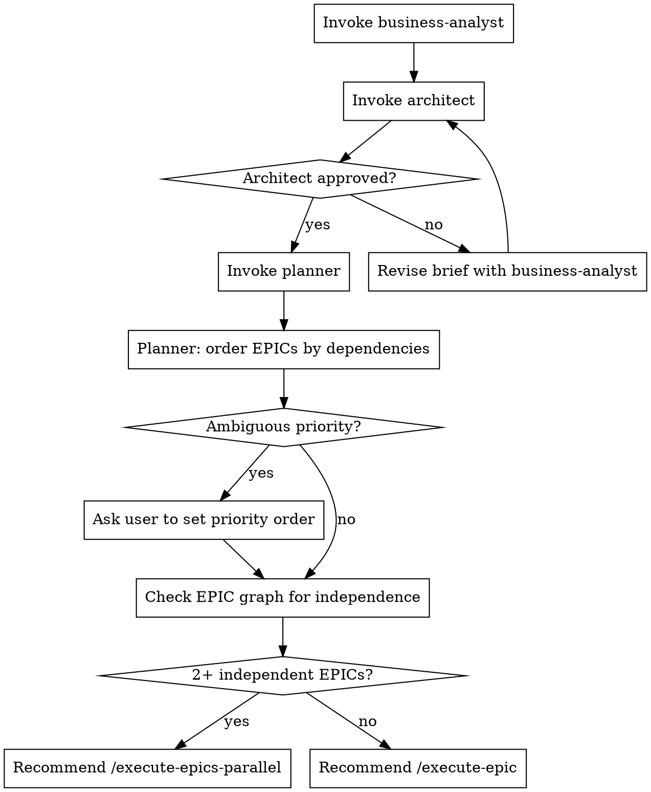

# Brainstorm Team

## Overview

Full SDLC pipeline orchestrating `business-analyst`, `architect`, and `planner` agents in sequence. Ends with a prioritized Beads backlog and a recommendation to execute.

## Flow



## Agent Instructions

### Step 1 — business-analyst

Invoke the `business-analyst` agent with the user's idea. It will:
- Ask structured elicitation questions
- Write a requirements brief to `docs/requirements/`
- Write stories with acceptance criteria
- Return when the brief is approved by the user

### Step 2 — architect

Invoke the `architect` agent, passing the path to the approved requirements brief. It will:
- Review the brief for architectural concerns
- Write ADRs to `docs/arch/`
- Return one of: **Approved**, **Approved with changes**, **Recommend alternative**

If the architect returns "Recommend alternative", loop back: revise the brief with `business-analyst` and re-submit to `architect` before continuing.

### Step 3 — planner

Invoke the `planner` agent with the architect-approved brief. It will:
- Decompose into EPIC → FEATURE → TASK hierarchy in Beads
- Set dependency links between issues
- Order EPICs by their dependency chain (EPICs blocked by others come after their blockers)
- Ask the user to set priority when two EPICs have no clear dependency relationship

### Step 4 — Recommendation

After the planner completes, inspect the EPIC graph:

```bash
bd graph
```

- If 2+ EPICs have no mutual dependencies → tell the user: "Multiple independent epics were created. Consider running `/execute-epics-parallel` to work on them simultaneously."
- If only 1 EPIC or all EPICs are sequential → tell the user: "Run `/execute-epic` to begin implementation."
