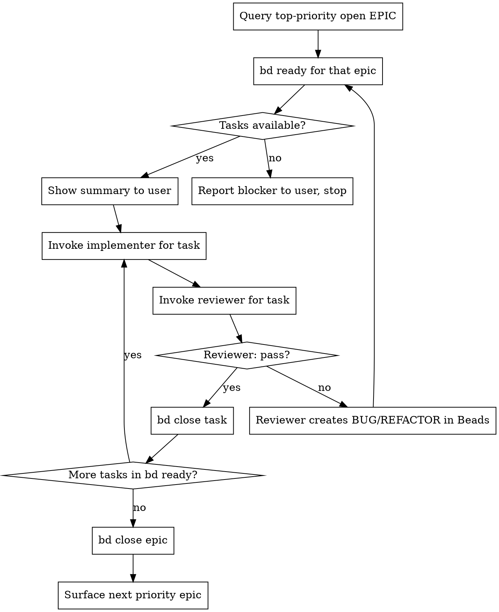

# Execute Epic

## Overview

Picks the top-priority open EPIC from Beads and runs the implementer → reviewer loop for every task until the epic is done.

## Flow



## Beads Commands

```bash
# Find the top-priority open EPIC (priority 0 = highest)
bd query "type=epic status=open"

# Show all ready tasks
bd ready

# Show tasks under a specific epic
bd list --parent <epic-id>

# Close a completed task
bd close <task-id>

# Close a completed epic
bd close <epic-id>

# Set epic priority if needed (0=highest, 4=lowest)
bd update <epic-id> -p 0
```

## Agent Instructions

**implementer:** Provide the task ID, acceptance criteria (from `bd show <task-id>`), and relevant file paths. The implementer delegates to the appropriate domain specialist (frontend, backend-dotnet, etc.).

**reviewer:** Provide the task ID and a summary of what was implemented. The reviewer will:
- Pass → close the task with `bd close <task-id>`
- Fail → it creates a BUG or REFACTOR issue in Beads automatically; loop back to `bd ready`

## Safety Gate

Before starting, run:
```bash
bd query "type=epic status=open"
```

If no EPICs exist, or if `bd ready` returns nothing, stop. Report which dependency is blocking the ready work and surface it to the user.
